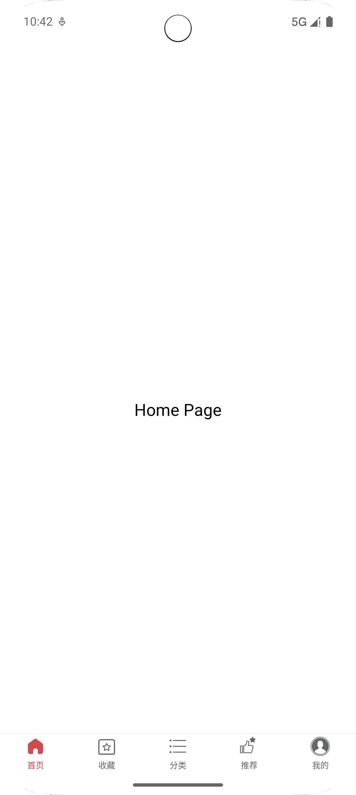
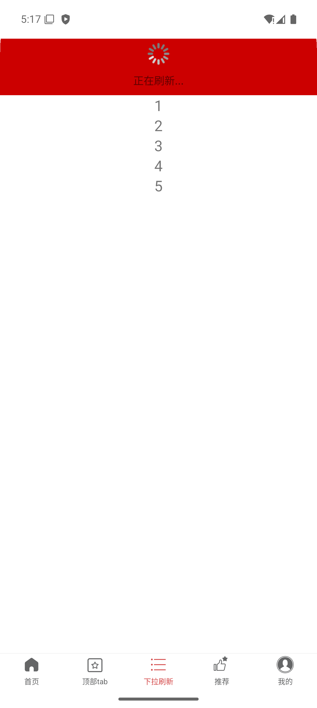
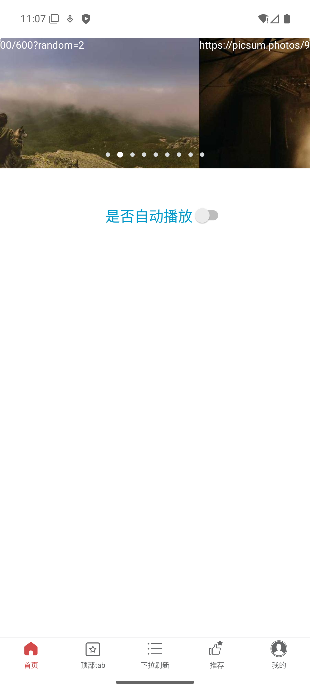
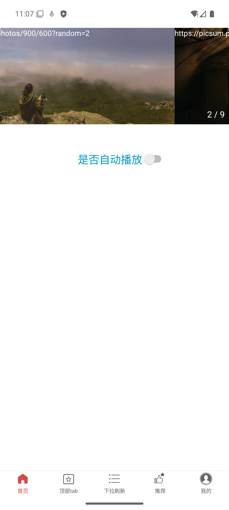

# Practice Android 
安卓App基础架构 + 通用组件

## 📱 应用截图

<table>
<tr>
    <td align="center">底部导航组件</td>
    <td align="center">顶部导航组件</td>
    <td align="center">日志组件</td>
  </tr>
  <tr>
    <td></td>
    <td></td>
    <td></td>
  </tr>
  
<tr>
    <td align="center">下拉刷新</td>
    <td align="center">Banner(圆点指示器)</td>
    <td align="center">Banner(数字指示器)</td>
  </tr>
<tr>
    <td></td>
    <td></td>
    <td></td>
  </tr>
  
</table>